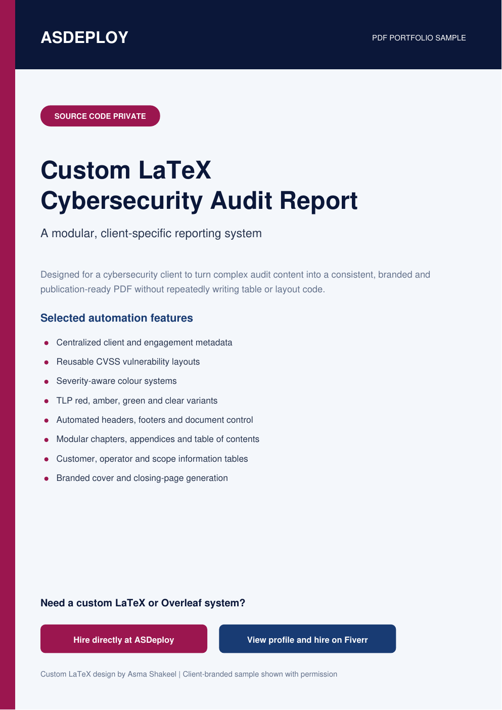
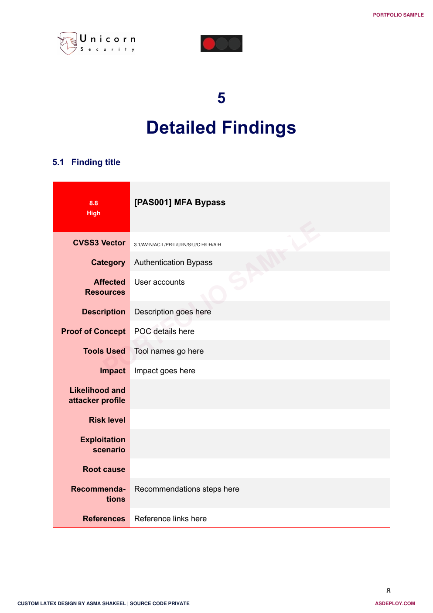
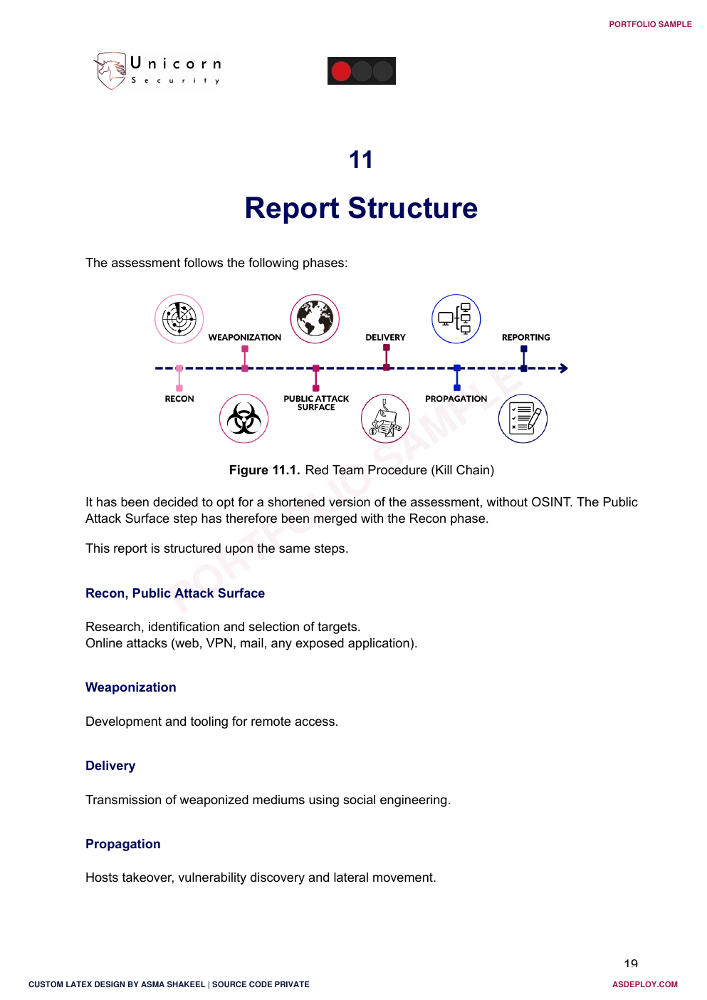

# Custom LaTeX Cybersecurity Audit Report | PDF Portfolio

An approved, client-branded portfolio sample of a custom LaTeX and Overleaf reporting system designed for cybersecurity audits, penetration testing reports, red-team assessments, and executive security documentation.

> **PDF portfolio only.** The LaTeX source, document class, reusable commands, logos, and implementation details are private and are not distributed.

## View the portfolio sample

**[Open the complete PDF portfolio](custom-latex-cybersecurity-audit-report.pdf)**

## Need a custom LaTeX or Overleaf template?

- **[Hire me directly through ASDeploy](https://asdeploy.com)**
- **[View my references and hire me through Fiverr](https://www.fiverr.com/asmashakeel303?public_mode=true)**

I create private, client-specific LaTeX systems for researchers, cybersecurity teams, engineers, consultants, businesses, and technical organizations. Final deliverables can include organized source files, a reusable document class, automated components, an Overleaf-ready project, and a polished PDF.

## Project overview

This project was commissioned around a client's preferred branding and audit-report workflow. The resulting 22-page system separates content from presentation so that recurring reports remain consistent without repeatedly writing complex layout or table code.

The public PDF is a curated 11-page excerpt. It adds a portfolio introduction and displays selected client-branded pages with permission while keeping every reusable implementation detail private.

## Custom automation demonstrated

- Centralized client, engagement, auditor, contact, and revision metadata
- Reusable vulnerability and remediation layouts
- CVSS score, risk rating, and severity-aware colour presentation
- Traffic Light Protocol variants for red, amber, green, and clear states
- Automated document-control, header, footer, cover, and closing pages
- Modular chapters, appendices, and table of contents
- Customer, operator, scope, methodology, and stakeholder sections
- Styled notes, code output, figures, tables, and executive summaries
- Consistent branding across technical and managerial content

## Selected layouts

  
  &nbsp;
  

## Services available

- Custom LaTeX and Overleaf template development
- Cybersecurity, penetration-testing, and audit-report systems
- Research papers, theses, technical reports, and corporate documents
- Automated tables, findings, figures, citations, and appendices
- Word, Google Docs, or existing PDF conversion to maintainable LaTeX
- Brand implementation and reusable document-class development
- Troubleshooting, cleanup, and improvement of existing LaTeX projects

## Privacy and intellectual property

The original client-branded design is displayed with permission. Names and content in this public portfolio are sample or placeholder material and do not disclose a real engagement, client infrastructure, or vulnerability. The source implementation remains private.

See [NOTICE.md](NOTICE.md) for portfolio usage terms.

---

Custom LaTeX design by **Asma Shakeel**.

Related topics: LaTeX cybersecurity report, Overleaf audit template, penetration testing report design, red-team assessment report, CVSS vulnerability table, technical report automation, custom document class, PDF typesetting, and freelance LaTeX development.
